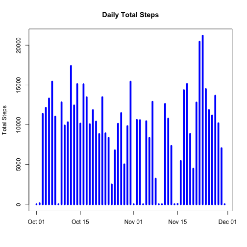
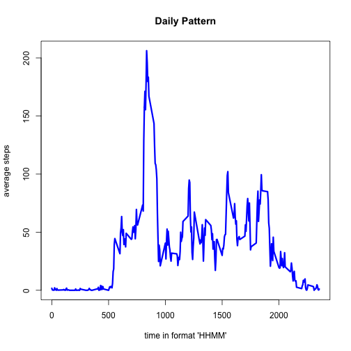
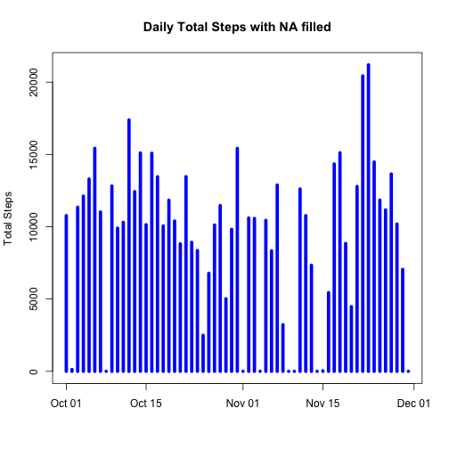
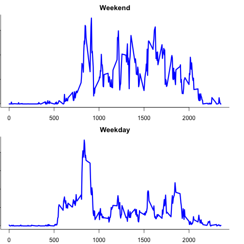

Reproducible Research Peer Accessment 1
========================================================

Created by Li Fan

## Loading and preprocessing the data

```r
setwd("/Users/eric/Documents/ReproResearch project 1")
activity<-read.csv("activity.csv")
```

## What is mean total number of steps taken per day?
1. Make a histogram of the total number of steps taken each day

```r
s1<-split(activity$steps,list(activity$date))
DayTotalStep<-sapply(s1,sum,na.rm=TRUE,simplify=TRUE)
plot(as.Date(names(DayTotalStep)),DayTotalStep,type="h",lwd=5,col="blue",
     main="Daily Total Steps",xlab="",ylab="Total Steps")
```

 
2. Calculate and report the mean and median total number of steps taken per day
The mean of total number of steps taken per day is

```r
mean(DayTotalStep)
```

```
## [1] 9354
```
The median of total number of steps taken per day is

```r
median(DayTotalStep)
```

```
## [1] 10395
```
## What is the average daily activity pattern?
1. Make a time series plot (i.e. type = "l") of the 5-minute interval (x-axis) and the average number of steps taken, averaged across all days (y-axis)

```r
s2<-split(activity$steps,list(activity$interval))
DailyPattern<-sapply(s2,mean,na.rm=TRUE,simplify=TRUE)
plot(names(DailyPattern),DailyPattern,type="l",col="blue",lwd=3,
     xlab="time in format 'HHMM'",ylab="average steps",main="Daily Pattern")
```

 

2. Which 5-minute interval, on average across all the days in the dataset, contains the maximum number of steps?


```r
names(DailyPattern)[DailyPattern==max(DailyPattern)]
```

```
## [1] "835"
```

## Imputing missing values
1. Calculate and report the total number of missing values in the dataset (i.e. the total number of rows with NAs)

```r
length(activity$steps[is.na(activity$steps)])
```

```
## [1] 2304
```
2. Devise a strategy for filling in all of the missing values in the dataset which is **using the mean for that 5-minute interval**
3. Create a new dataset that is equal to the original dataset but with the missing data filled in.

```r
IntervalMean<-function(interval) {
  DailyPattern[names(DailyPattern)==interval]
}
activityNoNA<-activity
activityNoNA$steps[is.na(activityNoNA$steps)]<-IntervalMean(activityNoNA$interval[is.na(activityNoNA$steps)])
```
4. Make a histogram of the total number of steps taken each day and Calculate and report the mean and median total number of steps taken per day.

```r
s3<-split(activityNoNA$steps,list(activityNoNA$date))
DayTotalStepNoNA<-sapply(s3,sum,na.rm=TRUE,simplify=TRUE)
plot(as.Date(names(DayTotalStepNoNA)),DayTotalStepNoNA,type="h",lwd=5,col="blue",
     main="Daily Total Steps with NA filled",xlab="",ylab="Total Steps")
```

 
The mean is

```r
mean(DayTotalStepNoNA)
```

```
## [1] 9531
```
The medianis

```r
median(DayTotalStepNoNA)
```

```
## [1] 10439
```

*In the histogram the most significant difference we notice is Oct 01, where raw data had all NA and it is now filled with average numbers. This also caused the mean and median to move slightly*
## Are there differences in activity patterns between weekdays and weekends?
1. Create a new factor variable in the dataset with two levels – “weekday” and “weekend” indicating whether a given date is a weekday or weekend day.

```r
activityNoNA$IsWeekday="weekday"
activityNoNA$IsWeekday[weekdays(as.Date(activityNoNA$date))=="Saturday"]<-"weekend"
activityNoNA$IsWeekday[weekdays(as.Date(activityNoNA$date))=="Sunday"]<-"weekend"
activityNoNA$IsWeekday<-as.factor(activityNoNA$IsWeekday)
```
2. Make a panel plot containing a time series plot (i.e. type = "l") of the 5-minute interval (x-axis) and the average number of steps taken, averaged across all weekday days or weekend days (y-axis). 


```r
activityWeekday<-activityNoNA[activityNoNA$IsWeekday=="weekday",]
activityWeekend<-activityNoNA[activityNoNA$IsWeekday=="weekend",]

s4<-split(activityWeekday$steps,list(activityWeekday$interval))
DailyPatternWeekday<-sapply(s4,mean,na.rm=TRUE,simplify=TRUE)

s5<-split(activityWeekend$steps,list(activityWeekend$interval))
DailyPatternWeekend<-sapply(s5,mean,na.rm=TRUE,simplify=TRUE)
##plotting
par(mfrow=c(2,1),bty="l",mar=c(2,0,2,2)+0.1)
plot(names(DailyPatternWeekend),DailyPatternWeekend,type="l",col="blue",lwd=3,
     xlab="",ylab="",main="Weekend")
plot(names(DailyPatternWeekday),DailyPatternWeekday,type="l",col="blue",lwd=3,
     xlab="",ylab="",main="Weekday")
```

 
